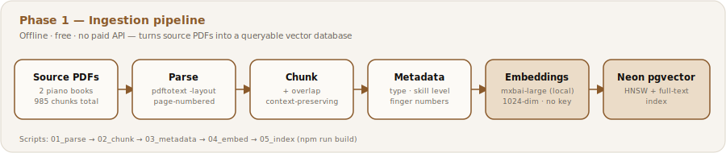
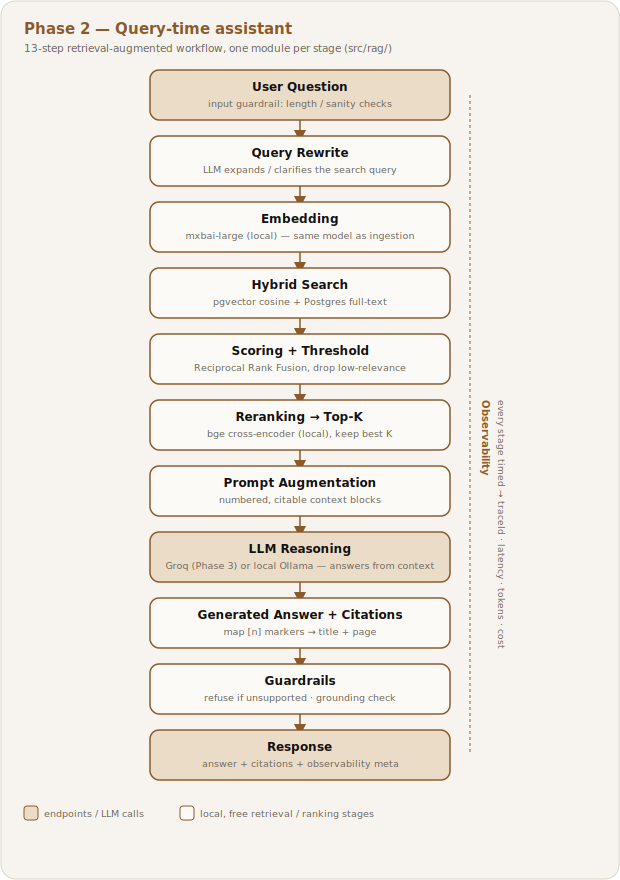
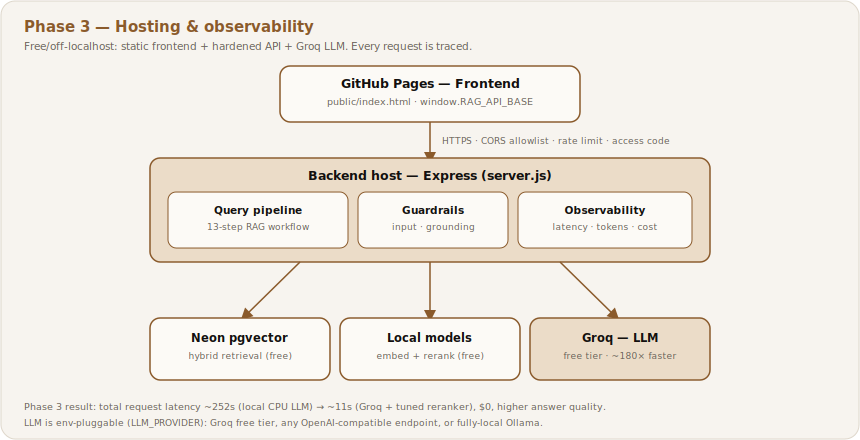
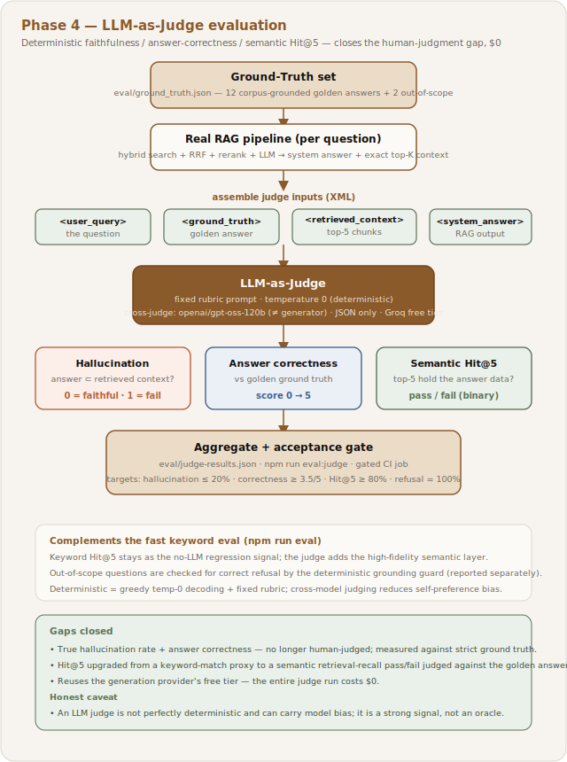

# AI-Native Piano Learning RAG Assistant

A retrieval-augmented generation (RAG) assistant over a piano-learning knowledge
base, built in three phases: an **offline ingestion pipeline**, a **query-time
assistant**, and **free off-localhost hosting with built-in observability**.
Everything runs on free/local, open-source components by default; the only
optional hosted piece (the LLM in Phase 3) uses a **free tier** — no paid API
anywhere. Built as part of [My AI Portfolio](https://github.com/shayeeboy)
alongside the [AI-Native Team Diagnostic](https://github.com/shayeeboy/ai-native-diagnostic).

---

## Try it live

**🎹 [Open the assistant →](https://shayeeboy.github.io/Enterprise-RAG-Assistant/?api=https://rag-assistant-694391756200.us-central1.run.app)**

A static [GitHub Pages](https://shayeeboy.github.io/Enterprise-RAG-Assistant/) chat
front end calling a [Google Cloud Run](https://rag-assistant-694391756200.us-central1.run.app/health)
backend (Express + local retrieval/rerank) with **Groq** doing the reasoning and
**Neon** holding the vectors — all on free tiers, $0.

- Ask things like *"How do I build finger independence?"* or *"What exercises help weak 4th and 5th fingers?"*
- Every answer cites its sources (book + page) and shows a live latency/tokens/cost line.
- **Heads-up:** the backend scales to zero, so the first request after idle takes ~30 s to wake; subsequent ones are fast.

---

## Executive Summary

**Problem.** Piano method books and exercise references (Chang's
*Fundamentals of Piano Practice*, Hanon's *Virtuoso Pianist*) are long,
unindexed, and don't map to how a learner actually asks questions — "what
should I do about a weak 4th finger" doesn't correspond to any table of
contents entry. This project builds a full RAG system to solve that
retrieval problem end-to-end, deliberately architected the way an
enterprise knowledge-base assistant would be: hybrid search, reranking,
citations, guardrails, and production observability — not a toy demo. The
piano corpus is the test case; the pattern (turn a large, domain-specific
document set into a cited, guarded Q&A service) is the same shape as an
internal enterprise KB over policy docs, runbooks, or onboarding material.

**User.** Primary (as built): a self-directed piano learner asking
practice and technique questions in natural language and getting a cited,
grounded answer instead of a manual search through 200+ pages. Enterprise
analogue: a new employee or support agent querying an internal knowledge
base instead of keyword-searching a wiki — same retrieval and trust
problem (does the answer cite the *right* source, and does the system
know when to say "I don't know"), different corpus.

**Objective.** Build a production-shaped RAG architecture — hybrid
retrieval, reranking, cited generation, and refusal guardrails — on a real,
non-trivial corpus, with the discipline of a system built to be trusted,
not just demoed. The piano knowledge base is the test bed; the actual
objective is showing the pattern works end-to-end: ingest a real
document set, retrieve accurately, generate only from what's retrieved,
and know when to say "I don't know." That pattern is what would transfer
to an enterprise KB, not the piano content itself.

**Enterprise applicability.** What's being demonstrated is the *operational
lifecycle* of a production RAG platform, exercised end-to-end — ingestion, hybrid
retrieval, **evaluation** (a deterministic LLM-judge), **observability**
(per-request tracing), **deployment** (free-tier, off-localhost), **governance**
(cited answers, refusal guardrails, source attribution), and **continuous
improvement** (nightly eval + benchmark). The piano books are just the test
corpus; that lifecycle is the transferable part.

**Success metric.** Two tiers, deliberately kept separate:

- **System health** — measured live, per request, via built-in observability persisted to a searchable Neon table.
  - **Tracked:** latency (p50/p95), token cost, and "grounded rate" (does every answer carry a citation).
  - **Current:** 100% grounded · $0 LLM cost (Groq free tier) · latency tracked live — see [Live observability](#live-observability).
  - **Made statistically meaningful:** an automated benchmark (`npm run bench`, a 120-question bank) drives realistic queries through the real pipeline, so the figures rest on a large sample rather than a handful of hits.
  - **Kept honest:** benchmark traffic is tagged and counted separately from organic `live` queries — test traffic by design, not a claim of real-world usage.
- **Retrieval quality** — because "grounded" only confirms an answer *has* a citation, not that it cites the *right* passage.
  - **First-pass (keyword eval, `npm run eval`):** Hit@5 100% (8/8) · MRR 0.938 · out-of-scope refusal 100% (2/2).
  - **Caveat:** relevance is a keyword proxy over 10 questions — a regression signal, not human-judged ground truth.
  - **Deeper (Phase 4 LLM-judge, `npm run eval:judge`):** a deterministic judge scores answer correctness, hallucination rate, and a *semantic* Hit@5 over a larger golden set — see [Phase 4](#phase-4-llm-judge-evaluation).

**Acceptance criteria (retrieval quality).** Concrete, checkable targets —
each with how it's verified and where the automated test lives:

| Criterion | Target | Current | Checked by |
|---|---|---|---|
| Retrieval hit rate (Hit@5) | ≥ 80% of benchmark questions surface a relevant passage in the top 5 | **100% (8/8)** | `npm run eval` |
| Rank quality (MRR) | higher is better | **0.938** | `npm run eval` |
| Out-of-scope refusal | 100% of out-of-KB questions refused, none answered from irrelevant context | **100% (2/2)** | `npm run eval` |
| Groundedness | every *answered* question carries ≥ 1 valid citation | **100% grounded** (live) | observability · `/stats` |
| Citation validity | every `[n]` resolves to a real retrieved chunk (title + page); invalid markers dropped | enforced by construction | `npm run check` |
| Latency | p50 / p95 tracked and visible | tracked live — see [Live observability](#live-observability) | observability · `/stats` |
| Cost / query | tracked | **$0** (Groq free tier) | observability · `/stats` |
| Faithfulness (LLM-judge) | answers strictly derivable from retrieved context | **76%** (hallucination 24%) | `npm run eval:judge` |
| Answer correctness (LLM-judge, 0–5) | mean score vs human-validated golden answers | **3.06 / 5** | `npm run eval:judge` |
| Semantic Hit@5 (LLM-judge) | top chunks semantically contain the answer (not keyword match) | **71% (12/17)** | `npm run eval:judge` |

**Now measured (Phase 4 — [LLM-Judge evaluation](#phase-4-llm-judge-evaluation)):**
a deterministic LLM-judge now scores true hallucination rate, answer correctness
(vs golden answers), and a *semantic* Hit@5 — closing the two honest gaps that
previously needed human judgement. Reference run: **faithfulness 76%,
correctness 3.06 / 5, semantic Hit@5 71%, refusal 40%** — deliberately honest
"in progress" numbers that surfaced real weaknesses the keyword proxy hid (it
had reported Hit@5 100%). Still N/A: there is no response cache, so "cache hit
rate" doesn't apply.

**Key trade-off decisions** *(decision — why)*:
- **Local embeddings + reranker, but a pluggable LLM** — on-device embeddings/rerank cost $0 and need no key; the LLM stayed swappable because observability showed CPU inference was the bottleneck (~78% of a 252 s request). A measured A/B → Groq free tier cut latency **~252 s → ~11 s (~23×) at $0**.
- **Hybrid search (vector + keyword) fused with RRF, not vectors alone** — dense embeddings catch paraphrase, keyword catches exact domain terms (finger numbers, "Hanon"); RRF merges both without calibrating two score scales.
- **Google Cloud Run over HF Spaces / Render — decided by hitting real limits** — HF Docker needed a paid plan and Render's free 512 MB couldn't fit the models; Cloud Run's free tier runs the Dockerfile unchanged at 1–4 GiB.
- **Guardrails that refuse over guardrails that hedge** — if nothing clears the relevance threshold the assistant declines rather than fabricate: fewer answered questions, but no confident-sounding ungrounded ones.
- **Accepted, documented gap: Hanon's notation isn't retrievable** — `pdftotext` can't read staff notation, so exercises are found by their surrounding prose, not note content; kept visible with a stated fix path (vision-model rasterization).

**User feedback — change request (implemented).** A reviewer asked that each
answer's citations be **clickable and open the source at the exact page**, not
just name a book and page. Delivered as a **Phase 2 + Phase 3** enhancement: the
answer path attaches a per-citation deep link (`source_url#page=N`) to every
citation ([Phase 2](#phase-2-query-time-assistant)), and the source PDFs are
**self-hosted on the GitHub Pages site** with the chat UI rendering the
**Sources** list as links that open the cited page in a new tab
([Phase 3](#phase-3-hosting-and-observability)). *Fundamentals of Piano Practice*
is live and **page-verified** (`#page=N` matches the ingested pages); the Hanon
deep-link is pending the exact ingested file (a different edition was first
supplied), so Hanon citations render as plain text until then.

### How it works

An enterprise-style RAG assistant that turns two piano-practice books into a
cited, guarded question-answering service — engineered so every layer is free
and swappable.

| Phase | What it does | Headline result |
|---|---|---|
| [**Phase 1 — Ingestion**](#phase-1-ingestion) | PDFs → parse → chunk → metadata → local embeddings → Neon pgvector | 985 chunks indexed, fully offline, no API key |
| [**Phase 2 — Query-time assistant**](#phase-2-query-time-assistant) | 13-step RAG workflow: rewrite → hybrid search → rerank → LLM → citations → guardrails | grounded, cited answers; CLI + API + chat UI |
| [**Phase 3 — Hosting & observability**](#phase-3-hosting-and-observability) | deploy-ready hardening, LLM moved to Groq free tier, per-request tracing | **~252 s → ~11 s** at **$0** (see below) |
| [**Phase 4 — LLM-Judge evaluation**](#phase-4-llm-judge-evaluation) | deterministic judge scores faithfulness, answer-correctness, and semantic Hit@5 vs golden answers | closes the human-judgment gaps; faithfulness 76%, correctness 3.06/5, refusal 40%, $0 |

**Knowledge base (this build):**

| Document | Author | Pages | Type |
|---|---|---|---|
| *Fundamentals of Piano Practice* | Chuan C. Chang | 202 | Method book (technique, practice methods, theory) |
| *The Virtuoso Pianist, Part I* | C. L. Hanon | 21 | Exercise book (20 numbered finger exercises) |

**Key outcomes**
- **Free by default:** local embeddings + local reranker + Neon free tier; the LLM is either fully-local (Ollama) or Groq's free tier — $0 either way.
- **Fast:** observability pinpointed CPU LLM inference as the bottleneck; moving to Groq and tuning the reranker cut a request from **~252 s to ~11 s (~23×)**.
- **Grounded:** answers cite their sources by page; guardrails refuse when the knowledge base doesn't support an answer.
- **Portable:** every stage is env-swappable (`EMBED_MODEL`, `RERANK_MODEL`, `LLM_PROVIDER`, …); no vendor lock-in.

**Navigate:** [Try it live](#try-it-live) · [Live observability](#live-observability) · [Phase 1](#phase-1-ingestion) · [Phase 2](#phase-2-query-time-assistant) · [Phase 3](#phase-3-hosting-and-observability) · [Phase 4](#phase-4-llm-judge-evaluation) · [Repo structure](#repo-structure) · [Tools and services](#tools-and-services) · [Lessons learned](#lessons-learned)

---

## Live observability

Every query is traced and **persisted to a searchable Neon table** (`query_logs`)
— see [Phase 3](#phase-3-hosting-and-observability). Aggregates below refresh
automatically (via `.github/workflows/stats.yml`); search individual attempts
with `npm run logs -- "your term"`, or hit the live `/stats` endpoint.

<!-- STATS:START -->
_Auto-updated from **55** logged queries · last refresh 2026-07-18._

| Metric | Value |
|---|---|
| Total queries | 55 |
| — real traffic (live) | 46 |
| — benchmark traffic (automated) | 9 |
| Grounded (cited) | 87% |
| Avg latency | 12,228 ms |
| p50 / p95 latency | 7,018 / 29,975 ms |
| Avg stage split — rewrite · retrieve · rerank · llm | 377 · 4,265 · 7,818 · 928 ms |
| Avg tokens / query | 1,908 |
| Total tokens | 104,918 |
| Total LLM cost | $0.000000 |
<!-- STATS:END -->

[↑ Back to top](#executive-summary)

---

## Phase 1: Ingestion

Turns the source PDFs into a queryable vector database. Each stage is an
isolated script in `scripts/`, so any stage can be swapped (a different
embedding model, a different vector DB) without touching the others. Every stage
but the last runs fully offline on this repo's contents — including embeddings,
which use a local model with no API key. Only the final indexing stage needs
network access, for the Neon Postgres database (a `DATABASE_URL`); no
third-party API credentials are required at any stage.



**Workflow steps**

```
Knowledge Base → Document Parsing → Chunking → Chunk Overlap → Embeddings → Metadata → Indexing → Vector Database
```

### 1. Knowledge Base

Two source PDFs: `fundamentals-of-piano-practice-readthedocs-io-en-latest.PDF`
and `virtuoso-pianist-pt1-a4.PDF`, placed in `data/uploads/`.

### 2. Document Parsing — `scripts/01_parse.js`

- Extracts text with `pdftotext -layout` (preserves reading order for
  single/multi-column pages).
- Splits on the form-feed character pdftotext inserts between pages, so
  every page keeps its page number — this becomes citation metadata later
  ("Fundamentals of Piano Practice, p.42").
- Cleans line-break hyphenation artifacts (`tech-\nnique` → `technique`)
  and collapses stray whitespace, without destroying paragraph breaks.
- Drops near-empty pages (running headers, blank separators).
- Output: `data/parsed/<doc>.json` — `{ doc_id, title, author, pages: [{ page, text }] }`.

**Result:** 202 usable pages from *Fundamentals*, 21 from *Hanon* (the Hanon
score is mostly musical notation glyphs, which `pdftotext` renders as
unrecognizable symbols — only the surrounding prose per exercise, e.g.
"Nº 3. (2-3-4) Before beginning to practise Nº 3…", is meaningfully
retrievable as text. This is a known limitation for scanned/notation-heavy
PDFs — see *Design decisions* below.)

### 3. Chunking — `scripts/02_chunk.js`

- Sentence-aware chunking: text is split into sentences first, then packed
  greedily into ~1,400-character (~350-token) chunks — never splitting a
  sentence in half.
- Chunk size was chosen to be large enough to keep a full technique
  explanation or exercise instruction intact, small enough for precise
  retrieval and to stay well under typical embedding model input limits.
- Chunks can span a page boundary; `page_start`/`page_end` are tracked so a
  chunk that starts on page 41 and ends on page 42 is still citable.

### 4. Chunk Overlap — (part of `scripts/02_chunk.js`)

- ~200 characters (~15% of chunk size) from the end of each chunk are
  carried into the start of the next.
- Purpose: prevents a technique instruction that lands right at a chunk
  boundary from losing its context — e.g. a sentence like "the thumb should
  pass under smoothly" shouldn't be split from the sentence before it that
  explains *when* to do it.
- Verified on real output: chunk 5 ends "…the most important factor for
  learning to play the piano is the practice methods." and chunk 6 opens
  with that same sentence before continuing — confirming overlap works as
  designed.

### 5. Embeddings — `scripts/04_embed.js`

- Runs a **local embedding model** — `mixedbread-ai/mxbai-embed-large-v1`
  (a BGE-large finetune) — via **Transformers.js** (`@xenova/transformers`).
  No API key, no per-call billing, and no network at inference time after
  the one-time model download. Chunks are embedded in batches of 16 with
  CLS pooling and L2 normalization.
- **Asymmetric retrieval** is preserved: documents are embedded as-is here,
  while queries should be prefixed at retrieval time with the model's
  instruction (`RETRIEVAL_QUERY_PREFIX`, exported from `04_embed.js`) —
  the same document-vs-query asymmetry that improves recall.
- 1,024-dimensional output — a reasonable balance of retrieval quality vs.
  storage/index size for a knowledge base this size (985 chunks), and it
  keeps the `vector(1024)` schema and HNSW index unchanged.
- **Swap-in note:** the model is pluggable via `EMBED_MODEL=...`, and because
  each stage is isolated you can drop in a hosted provider (Voyage AI's
  `voyage-3.5`, OpenAI `text-embedding-3-*`, etc.) by editing only this file
  — adjust `EMBEDDING_DIM` + `sql/schema.sql` if the dimension differs.

### 6. Metadata — `scripts/03_metadata.js`

Runs offline, right after chunking, so metadata is available before the
embedding call (order in the code differs slightly from the diagram for
this reason — see *Design decisions*). Adds per chunk:

- `source_type`: `method-book` vs `exercise-book`
- `content_type`: `exercise` / `technique` / `practice-method` / `theory` /
  `narrative` — keyword-classified
- `skill_level`: `beginner` / `advanced` / `unspecified`
- `finger_numbers`: e.g. `["3-4-5"]`, extracted from Hanon-style notation
  like "(3-4-5)" so a query like "exercises for my weak 4th and 5th finger"
  can filter directly
- `keywords`: lightweight frequency-based keyword extraction for hybrid
  (BM25 + vector) search

**Result on this run:** 354 technique chunks, 243 exercise chunks, 170
practice-method chunks, 150 narrative, 68 theory.

### 7. Indexing — `scripts/05_index.js`

- Idempotent bulk upsert into Postgres: multi-row `INSERT … ON CONFLICT DO
  UPDATE`, batched 100 rows per statement.
- Re-running after a knowledge base update (e.g. adding a third method
  book) only touches changed rows.
- **Requires `DATABASE_URL` (Neon connection string)** — run alongside or
  after the embedding stage.

### 8. Vector Database — Neon Postgres + pgvector

Schema in `sql/schema.sql`:

- `documents` table (one row per source book) and `chunks` table (one row
  per chunk, `embedding vector(1024)` column).
- **HNSW index** on `embedding` with cosine distance — better recall/speed
  tradeoff than IVFFlat for a KB this size, and doesn't need a training
  step before it's usable (IVFFlat needs data present before building the
  index; HNSW builds incrementally).
- B-tree indexes on `doc_id`, `content_type`, `skill_level` for metadata
  pre-filtering (e.g. "only exercises, only Hanon") ahead of vector search.
- Generated `tsvector` column + GIN index for hybrid keyword+vector search.

### Build it

```bash
npm install

# offline stages — no network/API keys needed
npm run offline    # parse → chunk (+overlap) → metadata

# embeddings — local model, no API key (first run downloads the model)
npm run embed      # optional: EMBED_MODEL=... to swap the model

# indexing — needs a Postgres (Neon) connection string
DATABASE_URL=postgres://... npm run index
```

### Acceptance tests (ingestion integrity)

Verified against the live index by **`npm run smoke`** (read-only):

| Test case | Expectation | Source |
|---|---|---|
| Documents & chunks loaded | 2 documents, 985 chunks | functional test while building |
| Every chunk embedded | 985/985 have a non-null vector | `npm run smoke` |
| Embedding dimensionality | 1024-dim (matches `vector(1024)`) | `npm run smoke` |
| Page ranges preserved | each chunk carries `page_start`/`page_end` (citation source of truth) | schema + parse stage |
| Metadata populated | `content_type`/`skill_level` classified per chunk | metadata stage |

### Design decisions

- **Neon over self-hosted Postgres**: serverless scale-to-zero fits a
  portfolio/demo project's usage pattern (mirrors the same reasoning
  used for `ai-native-diagnostic` v3's backend).
- **pgvector over a dedicated vector DB** (Pinecone, Weaviate): one
  database for both structured metadata and vectors means metadata
  filtering and vector search happen in a single SQL query — simpler
  ops for a KB this size, and Neon has first-class pgvector support.
- **Local embeddings over a paid API**: embeddings run on-device with
  `mixedbread-ai/mxbai-embed-large-v1` via Transformers.js — zero API cost,
  no keys, fully reproducible offline. It's a 1024-dim BGE-large finetune,
  so quality is competitive with hosted options while keeping the schema
  identical. The stage stays provider-agnostic: swapping in a hosted
  embedder (Voyage AI, OpenAI, etc.) touches only `04_embed.js`.
- **Metadata before embeddings in execution order**: the diagram lists
  Embeddings → Metadata, but running metadata extraction first means the
  (comparatively expensive) embedding pass only happens once the chunk
  boundaries and tags are finalized — avoids re-embedding if a metadata
  rule changes.
- **Known limitation — Hanon notation**: `Nº 1` through `Nº 20` are
  primarily musical staff notation, not text. `pdftotext` extracts the
  surrounding instructional prose (fingering guidance, tempo markings,
  practice notes) but not the notes themselves. A future version could
  rasterize each exercise page and use a vision-capable model to describe
  the notation, or link out to the MuseScore/Mutopia source files.

[↑ Back to top](#executive-summary)

---

## Phase 2: Query-time assistant

Phase 1 loads the vector DB; Phase 2 answers questions from it. The assistant
runs the full retrieval-augmented workflow below — the same local embedding
model as ingestion, a local cross-encoder reranker, and a pluggable LLM
(local Ollama by default; Groq in Phase 3). No stage requires a paid API.



**Workflow steps**

```
User Question
   → Query Rewrite       LLM expands/clarifies the query
   → Embedding           mxbai-embed-large-v1 (same model as ingestion)
   → Hybrid Search       pgvector cosine + Postgres full-text
   → Scoring             Reciprocal Rank Fusion of the two result sets
   → Threshold           drop low-similarity / non-matching candidates
   → Reranking           bge-reranker-base cross-encoder scores each pair
   → Top-K Chunks        keep the best K for the prompt
   → Prompt Augmentation numbered, citable context blocks
   → LLM Reasoning       model answers from the context only
   → Generated Answer
   → Citations           map [n] markers back to title + page
   → Guardrails          input checks; refuse when unsupported; grounding check
   → Response
```

**Each step → its module** (`src/rag/`):

| Workflow step | Module | Free/local tool |
|---|---|---|
| Query Rewrite | `rewrite.js` | LLM (Ollama or Groq) |
| Embedding | `embed.js` | Transformers.js · `mxbai-embed-large-v1` |
| Hybrid Search + Scoring + Threshold | `retrieve.js` | pgvector + Postgres FTS + RRF |
| Reranking + Top-K | `rerank.js` | Transformers.js · `bge-reranker-base` |
| Prompt Augmentation | `prompt.js` | — (string assembly) |
| LLM Reasoning | `llm.js` | Ollama / OpenAI-compatible (pluggable) |
| Citations + Guardrails | `guardrails.js` | rule-based |
| Orchestration + observability | `pipeline.js`, `trace.js` | — |

### Why these tools (all free, no billing)

- **Local cross-encoder reranking** (`Xenova/bge-reranker-base`): the
  first-stage bi-encoder is fast but coarse; a cross-encoder re-scores each
  (question, chunk) pair jointly for much better precision — on CPU, no API key.
- **Hybrid search via RRF**: dense vectors catch paraphrase, keyword search
  catches exact terms (finger numbers, "Hanon"); Reciprocal Rank Fusion merges
  the two rankings without calibrating their different score scales.
- **Pluggable LLM**: local via Ollama keeps it zero-cost and offline; set
  `LLM_PROVIDER=openai-compatible` + `LLM_BASE_URL` to point at any hosted
  endpoint (e.g. Groq's free tier — see Phase 3) without touching the pipeline.
- **Guardrails**: if nothing clears the relevance threshold the assistant
  refuses rather than inventing an answer, and the generated answer is checked
  for real citations before it's returned.

### Setup & run

```bash
npm install
cp .env.example .env           # set DATABASE_URL; the LLM defaults are free/local

# one-time: install the local LLM runner (https://ollama.com), then pull a model
ollama pull llama3.2:3b        # small/fast default; llama3.1:8b for higher quality
                               # (or use Groq's free tier — see Phase 3)

# ask a question (CLI)
npm run query -- "How should I practice a difficult passage?"
VERBOSE=1 npm run query -- "exercises for weak 4th and 5th fingers"

# or run the local API + chat UI
npm run serve                  # http://localhost:8080  (POST /ask, GET /health)

# verify every layer is wired up and the DB is loaded (read-only)
npm run smoke                  # checks DB, embeddings, retrieval, rerank, LLM
```

The embedding and reranker models download once on first use (cached under
`node_modules`). Retrieval and reranking are fully local; only the final answer
needs the LLM. Tune `TOP_K`, `RERANK_INPUT`, `VECTOR_THRESHOLD`,
`RERANK_THRESHOLD`, and `ENABLE_QUERY_REWRITE` in `.env`.

> **Note:** the chat UI must be reached through the server (`npm run serve` →
> `http://localhost:8080`), not by opening `public/index.html` as a file — a
> relative `/ask` fetch needs an origin.

### Tests & CI

- `npm run check` — offline wiring + logic checks (module imports, guardrails,
  rank fusion, prompt assembly). No DB, LLM, or model downloads.
- `npm run smoke` — full read-only health check against the live DB
  (connectivity, embeddings, hybrid retrieval, rerank) plus an end-to-end answer
  when the LLM is up.

GitHub Actions (`.github/workflows/ci.yml`) runs `npm run check` on every push.
Add a `DATABASE_URL` repository secret to also run the full `npm run smoke` and
`npm run eval` in CI (the LLM step warns rather than fails there, since Ollama
isn't available in CI).

### Acceptance tests (retrieval & trust)

Two automated suites map to the [acceptance criteria](#executive-summary):

**`npm run check`** — offline unit acceptance of the trust-critical logic (no DB/LLM):

| Test case | Asserts |
|---|---|
| Input guardrail | empty/oversized questions are rejected before any compute |
| Citation validity | an invalid `[9]` marker against 2 sources is dropped; only real citations survive |
| Grounding detection | an answer with no `[n]` is flagged ungrounded; one with `[1]` is grounded |
| RRF fusion | a chunk present in both vector + keyword lists ranks first |
| Prompt augmentation | context blocks are numbered `[1]…[k]` |

**`npm run eval`** — retrieval-quality acceptance against the live index (`eval/questions.json`):

| Test case | Target | Current |
|---|---|---|
| Hit@5 on 8 in-scope questions | ≥ 80% | 100% (8/8) |
| MRR | higher is better | 0.938 |
| Refusal on 2 out-of-scope questions | 100% refused | 100% (2/2) |

### Enhancement — clickable citations (backend, from feedback)

Every citation now carries a **deep link to the exact source page**. The
retrieval join hydrates each chunk's `source_url` (per-document, stored in the
`documents` table); `extractCitations` and `sourceList` compute
`source_url#page=N` from the chunk's `page_start`; and the `/ask` response
includes a `url` on each citation — `null` when a document has no hosted PDF, so
it degrades gracefully to plain text. No re-embedding was needed: this is
document metadata plus a query-time field. See the UI + hosting half in
[Phase 3](#phase-3-hosting-and-observability).

[↑ Back to top](#executive-summary)

---

## Phase 3: Hosting and observability

Makes the assistant fast and deployable off localhost, and adds the
instrumentation that made the performance problem measurable in the first place
— all while staying free.



### Observability (built in)

Every query is traced with no external SDK (dependency-free; the shape is
OpenTelemetry-friendly for later export) — see `src/rag/trace.js`. Each request
returns a `meta` block:

| Signal | Field | Notes |
|---|---|---|
| **Tracing** | `meta.traceId` | correlates CLI output, server log, and API response |
| **Latency** | `meta.latencyMs` | `{ total, rewrite, retrieve, rerank, llm }` (ms) |
| **Errors** | `meta.error` | per-stage failure captured non-fatally |
| **Tokens** | `meta.tokens` | `{ prompt, completion, total }` |
| **Cost** | `meta.costUsd` | `0` for local/Groq-free; set `LLM_COST_*_PER_1K` for a metered provider |

It surfaces in the **API** response, a **one-line JSON server log** per request,
the **CLI** timing line, and a **chat-UI** meta line under each answer. In
deployment it is also **persisted to a searchable `query_logs` table** in Neon
(`src/rag/logstore.js`, auto-created on start) — powering `npm run logs`
(full-text search of attempts), the `/stats` endpoint, and the auto-updated
[Live observability](#live-observability) aggregates in this README.

### Decision: Path B — Groq free tier

Observability showed the LLM stage was ~78% of a ~250 s request on CPU. The fix
was to move the LLM to **Groq's free tier** — OpenAI-compatible, so it's an
env-only switch through the existing provider, no code change:

```
LLM_PROVIDER=openai-compatible
LLM_BASE_URL=https://api.groq.com/openai/v1
LLM_API_KEY=gsk_...            # free key from https://console.groq.com
LLM_MODEL=llama-3.3-70b-versatile
```

**Measured A/B** (same question, retrieval unchanged), plus the reranker tuning
(`RERANK_INPUT` 20 → 10):

| Stage | Local `llama3.2:3b` (CPU) | Groq `llama-3.3-70b` | + tuned reranker |
|---|---:|---:|---:|
| LLM reasoning | 195,801 ms | 1,070 ms | ~0.8 s |
| Query rewrite | 20,970 ms | 517 ms | ~0.5 s |
| Rerank (local) | 25,890 ms | 14,642 ms | **6,292 ms** |
| Retrieve (local) | 8,957 ms | 5,585 ms | ~3.3 s |
| **Total** | **~252 s** | **~22 s** | **~11 s** |

Net: **~23× faster** end-to-end, at **$0**, with higher answer quality (70B vs
3B). Answer quality also improved a citation bug — the small model used to echo a
literal `[n]`; the prompt was reworded to fix it. The three alternative hosting
paths (Groq, Oracle Always-Free self-host, browser WebGPU) and full rationale
are in [`docs/PHASE-3.md`](docs/PHASE-3.md).

### Deploy-ready hardening

`server.js` is env-driven for hosting the assistant behind a URL. All knobs are
optional and default to open local dev:

- `ALLOWED_ORIGINS` — CORS allowlist (set to your front-end origin in production)
- `RATE_LIMIT_MAX` / `RATE_LIMIT_WINDOW_MS` — per-IP rate limiting
- `ACCESS_CODE` — optional shared secret to gate `/ask`
- `window.RAG_API_BASE` / `window.RAG_ACCESS_CODE` — let a separately hosted
  (e.g. GitHub Pages) front end call the backend on another origin

**Deployment (live):** the frontend auto-publishes to **GitHub Pages**
(`.github/workflows/pages.yml`) and takes the backend URL as a `?api=` query
param; the backend runs as a container on **Google Cloud Run** (scale-to-zero,
free tier). Hugging Face Docker Spaces turned out to require a paid plan, and
Render's free 512 MB is too small for the models, so **Cloud Run** was chosen —
it runs the root `Dockerfile` unchanged at 1–4 GiB. Step-by-step for Cloud Run
(and HF/Render/Oracle alternatives) is in [`docs/DEPLOY.md`](docs/DEPLOY.md); the
per-path analysis is in [`docs/PHASE-3.md`](docs/PHASE-3.md).

### Acceptance tests (hardening & observability)

Verified functionally against the running Cloud Run service (`npm run smoke`
covers DB + LLM health):

| Test case | Expectation | Result |
|---|---|---|
| `GET /health` | `{ db: connected, llm: reachable }` | ✅ |
| CORS — allowed origin | `Access-Control-Allow-Origin` reflects the Pages origin | ✅ |
| CORS — disallowed origin | no ACAO header returned | ✅ |
| Rate limit | rapid `/ask` returns `429` after `RATE_LIMIT_MAX` | ✅ |
| Access code | `/ask` without valid `x-access-code` returns `401` when `ACCESS_CODE` set | ✅ |
| Observability persistence | each `/ask` inserts a `query_logs` row; `/stats` aggregates; `npm run logs` searches | ✅ |

### Enhancement — clickable citations (self-hosted PDFs + UI, from feedback)

The source PDFs are **self-hosted** from [`public/pdfs/`](public/pdfs/) (served
by GitHub Pages), and the chat UI renders each answer's **Sources** as links that
open the cited page — `source_url#page=N` — in a new tab (`target="_blank"
rel="noopener noreferrer"`), falling back to plain text when a document has no
URL. Hosting the **exact ingested PDF** keeps `#page=N` aligned with the stored
page numbers (from `pdftotext`'s indexing of that file); an
[alignment check](public/pdfs/README.md) confirmed *Fundamentals* matches at
offset 0 (~1.0 text overlap on sampled pages). `#page=` is honored by browsers'
built-in PDF viewers for a directly-served `application/pdf`. Backend half in
[Phase 2](#phase-2-query-time-assistant). _Two follow-ups: the correct 21-page
Hanon file (a different edition was first supplied, so its link is disabled for
now), and a Cloud Run redeploy so the live API returns the `url` field._

[↑ Back to top](#executive-summary)

---

## Phase 4: LLM-Judge evaluation

Phase 2's acceptance eval (`npm run eval`) measures retrieval with a **keyword
proxy** — a chunk counts as relevant if it contains an expected word. That's a
fast regression signal, but it can't tell whether an *answer* is faithful to its
sources or actually correct, and it reported a rosy **Hit@5 100% / MRR 0.938**.
Phase 4 closes those honest gaps with a deterministic **LLM-as-Judge**
(`npm run eval:judge`) that scores three things the proxy cannot.



### What it measures

For each question the harness runs the **real pipeline** to get the system answer
plus the exact top-K context it was built from, then a judge LLM scores:

- **Faithfulness / hallucination** (0 = faithful, 1 = hallucinated): is every
  assertion in the answer supported by the retrieved context?
- **Answer correctness** (0–5): how completely does the answer match a
  human-validated **golden answer**, using the ground truth as the gold standard?
- **Semantic Hit@5** (pass/fail): do the top chunks actually contain the
  substance needed to answer — judged semantically, not by keyword match?

Out-of-scope questions are checked separately for correct **refusal**.

### How it stays honest and free

- **Deterministic rubric:** the judge runs at **temperature 0** with a fixed
  rubric prompt (embedded verbatim in [`src/rag/judge.js`](src/rag/judge.js)) and
  emits strict JSON. An LLM judge is still not a perfect oracle — see the variance
  note in *Lessons learned*.
- **Cross-model judging:** the generator is `llama-3.3-70b-versatile`; the judge
  is a **different** model, `openai/gpt-oss-120b`, to blunt the self-preference
  bias a model has when grading its own output.
- **$0:** the judge reuses the same Groq free tier as generation; a token-aware
  sliding-window limiter paces calls under the model's tokens-per-minute cap.
- **Faithful generation:** answers are generated at **temperature 0** and passed
  through a **citation-grounding trim** (`ENFORCE_CITATIONS`) that drops
  substantive sentences citing no source; an optional local **NLI entailment
  filter** (`ENFORCE_ENTAILMENT`) can additionally drop sentences the retrieved
  context doesn't entail — all targeting the faithfulness metric.
- **Ground truth:** **17** golden answers written from the corpus itself
  ([`eval/ground_truth.json`](eval/ground_truth.json)) plus **5** out-of-scope
  cases, including adversarial near-misses (piano-adjacent but uncovered — piano
  history, self-tuning, jazz improv).

### Gaps addressed

| Honest gap (before) | Action taken (Phase 4) | Outcome |
|---|---|---|
| Hallucination rate + answer correctness were **not measured** — they needed human judgement | Deterministic LLM-judge scores faithfulness (answer ⊂ context) and correctness (0–5 vs golden answers) | Now measured every run: **faithfulness 76%, mean correctness 3.06 / 5** |
| Hit@5 was a **keyword-match proxy** (reported 100%) that can't tell real substance from a coincidental word | Judge re-scores Hit@5 **semantically** against the golden answer | Honest **semantic Hit@5 71% (12/17)** — the proxy was over-optimistic |
| No answer-quality regression signal in CI | `eval:judge` added to the gated CI job with regression floors (refusal floor is a hard 100%) | Build fails on a genuine quality regression, not on normal run-to-run noise |

### Results (reference run)

Generator `llama-3.3-70b-versatile`, judge `openai/gpt-oss-120b` (temp 0),
over 17 answerable + 5 out-of-scope questions:

| Metric | Result | Near-term goal | Met? |
|---|---|---|---|
| Faithfulness (no hallucination) | **76%** (hallucination 24%) | ≥ 85% | ✗ in progress |
| Mean answer correctness | **3.06 / 5** | ≥ 3.6 | ✗ in progress |
| Semantic Hit@5 | **71%** (12/17) | ≥ 90% | ✗ in progress |
| Out-of-scope refusal | **40%** (2/5) | 100% | ✗ in progress |

**Is this a regression from the previous run? No — the benchmark got harder.**
Isolating *this* run to the **same 12 questions** the previous run used shows the
system held or improved; the lower headline is entirely the 5 new (harder)
questions and the 3 new adversarial-refusal near-misses:

| Metric | Prev run · 12 Q | This run · **same 12 Q** | This run · **new 5 Q** | This run · all 17 |
|---|---|---|---|---|
| Faithfulness | 75% | **83%** ↑ | 60% | 76% |
| Correctness | 3.08 | **3.17** ↑ | 2.80 | 3.06 |
| Semantic Hit@5 | 83% | **83%** = | 40% | 71% |

On the identical set the system is flat-to-better (temp-0 + citation trim nudged
faithfulness up). The new answerable questions have weaker corpus coverage and
more comprehensive golden answers, and refusal fell because the 3 adversarial
near-misses (piano history, self-tuning, jazz) were added — 2/2 easy out-of-scope
still refuse, 0/3 near-misses did. The **answerability gate** (roadmap below)
addresses the refusal side; corpus expansion is the Hit@5 fix.

The judge **surfaced real problems the keyword eval hid** — that is the point.
None of these are a green-washed 100%. The original **12-question** run (temp
0.2, before the faithfulness work below) moved faithfulness **67% → 75%** and
correctness **2.67 → 3.08** while holding out-of-scope refusal at 100% (see
*Lessons learned*). This run measures the **expanded 17 + 5 set** with
temperature-0 generation and the citation-grounding trim in place — and it's
exactly the expanded set that moved Hit@5 and refusal: the **5** out-of-scope
questions now include adversarial near-misses (piano history, self-tuning,
jazz improv) that the old 2-question set never tested, and 3 of them get
answered instead of refused. CI's **regression floors** (looser than the
near-term goals above: hallucination ≤ 34%, correctness ≥ 2.7, Hit@5 ≥ 75%,
refusal = 100%) are **currently not met** — Hit@5 and refusal both fall short —
so this is a tracked, visible regression on the harder set, not a silent one.
See the roadmap below for the fix path.

### Improvement roadmap

The goals above are a roadmap, not a claim. Below is where each metric stands
now, the next milestone and stretch target, and the concrete work to get there —
most of it directly motivated by what the judge's reasoning traces flagged.

| Metric | Current | Near-term | Stretch | How to get there |
|---|---|---|---|---|
| Faithfulness (no hallucination) | 76% | ≥ 85% | ≥ 95% | ✅ **shipped:** temperature-0 generation; a citation-grounding trim (`ENFORCE_CITATIONS`); and a local **NLI entailment filter** (`ENFORCE_ENTAILMENT`, opt-in) that drops answer sentences the retrieved context doesn't entail. **Next:** tune the NLI threshold against the eval — strict sentence-level NLI is aggressive on synthesized sentences, so it's off by default until its effect is measured; harden the grounding prompt ("state only what a source explicitly says — never infer"). |
| Answer correctness (0–5) | 3.06 | ≥ 3.6 | ≥ 4.2 | Add 1–2 **few-shot exemplars** of thorough, fully-cited answers; raise `TOP_K` and add **multi-query / query-expansion** retrieval so more of the golden-answer substance reaches the prompt; close the corpus gaps below. |
| Semantic Hit@5 | 71% | ≥ 90% | ≥ 95% | **Expand the knowledge base** to cover the current misses (an absolute-beginner primer and a dedicated scales/technique reference); increase `HYBRID_CANDIDATES`; trial a larger embedding model or a fine-tuned reranker. |
| Out-of-scope refusal | 40% (pre-gate) | 100% | 100% (hold) | ✅ **shipped:** an **answerability gate** (`ANSWERABILITY_GATE`) — a focused LLM YES/NO on whether the retrieved chunks actually answer *this* question — catches near-misses the rerank floor can't (their chunks score as topically relevant as valid questions). Targeted tests show OOS refusal 2/5 → ~4/5 (only `tune-piano` still leaks — a chunk literally mentions tuning). Deliberately strict, so it also refuses the 2 thinnest-coverage in-scope questions. **Next:** full re-measurement via `eval:judge`. |
| Eval confidence | 22 Qs · single run | 30–40 Qs · median of 3 runs | 50+ Qs · judge ensemble + human calibration | ✅ **shipped:** grew the set 14 → 22 (17 answerable + 5 out-of-scope, incl. adversarial near-misses). **Next:** report the **median of N runs** to damp judge variance; add a second judge model and periodic **human spot-checks** to calibrate the judge itself. |

**Enabler:** larger, repeated eval runs need headroom beyond the Groq free
tier's 100k-tokens/day cap — either a paid dev tier or a **local judge model**
(Ollama) for bulk runs, keeping the free hosted judge for CI.

### Acceptance tests (evaluation harness)

The judge harness is itself tested, so its verdicts can be trusted:

| Test case | Expectation | Where |
|---|---|---|
| Judge output is valid JSON in the required schema | parses; out-of-range metrics rejected | `npm run check` |
| Clean, code-fenced, and prose-wrapped outputs all parse | robust extraction | `npm run check` |
| Judge sees the **exact** context the generator used | no false hallucination on `[6]` citations | `src/rag/judge.js` (top-K, not top-5) |
| Ground-truth dataset integrity | ≥ 12 cases, every answerable has a golden answer, unique ids | `npm run check` |
| Rate-limited generation is never scored as 0 | run aborts loudly instead of reporting bogus metrics | `scripts/eval-judge.js` |
| Full judge run (DB + LLM) | faithfulness / correctness / Hit@5 / refusal vs floors | `npm run eval:judge` (gated CI) |

[↑ Back to top](#executive-summary)

---

## Repo structure

```
Enterprise-RAG-Assistant/
├── README.md                  ← this file
├── package.json
├── assets/                    ← phase architecture diagrams (SVG)
├── eval/
│   ├── questions.json         ← keyword retrieval benchmark (npm run eval)
│   └── ground_truth.json      ← golden answers for the LLM-judge (npm run eval:judge)
├── docs/PHASE-3.md            ← hosting analysis, A/B results, observability
├── data/
│   ├── raw/                   ← pdftotext output (gitignored — regenerate from PDFs)
│   ├── parsed/                ← stage 2 output
│   └── chunks/                ← stage 3/4/6 output (chunks, enriched, embedded)
├── scripts/
│   ├── 01_parse.js  02_chunk.js  03_metadata.js
│   ├── 04_embed.js            ← local embeddings (Transformers.js, no API key)
│   ├── 05_index.js            ← requires DATABASE_URL
│   ├── 06_query.js            ← Phase 2: ask a question from the CLI
│   ├── check.js               ← offline wiring/logic checks (npm run check)
│   ├── smoke.js               ← full DB+models+LLM health check (npm run smoke)
│   └── eval-judge.js          ← Phase 4 LLM-judge harness (npm run eval:judge)
├── src/rag/                   ← Phase 2 query library (one module per stage)
│   ├── pipeline.js            ← orchestrates the full workflow
│   ├── rewrite.js  embed.js  retrieve.js  rerank.js
│   ├── prompt.js   llm.js     guardrails.js  trace.js
│   ├── judge.js               ← Phase 4 LLM-as-Judge (rubric, XML I/O, JSON parse)
│   ├── nli.js                 ← local NLI entailment faithfulness filter (opt-in)
│   ├── gate.js                ← answerability gate (near-miss out-of-scope refusal)
│   ├── meta.js                ← conversational intents (identity · greeting · thanks · bye) — honest, no refusal
│   ├── db.js                  ← pooled Neon connection
│   └── config.js              ← env-driven, free/local defaults
├── server.js                 ← API + chat UI (CORS, rate limit, access code)
├── public/index.html         ← minimal chat front end (RAG_API_BASE aware)
├── public/pdfs/              ← self-hosted source PDFs for clickable citations
├── .env.example
├── .github/workflows/ci.yml
└── sql/schema.sql
```

## Tools and services

| Layer | Tool/Service | Why |
|---|---|---|
| Runtime | Node.js | Matches existing portfolio stack |
| PDF text extraction | `poppler-utils` (`pdftotext`) | Fast, preserves page breaks & layout, no API cost |
| Chunking / metadata | Plain JS (no framework) | Small, auditable, no black-box chunking library |
| Embeddings | **Transformers.js** + `mxbai-embed-large-v1` (local, 1024-dim) | Free, no API key, reproducible offline; pluggable via `EMBED_MODEL` |
| Vector database | **Neon Postgres + pgvector** | Serverless Postgres with native vector search; one DB for metadata + vectors |
| DB indexing | HNSW (pgvector) | Better recall/speed for this KB size, incremental build |
| DB driver | `pg` (node-postgres) | Standard, well-supported Postgres client for Node |
| Hybrid search | pgvector cosine + Postgres full-text, fused with RRF | Combines semantic + keyword recall, no extra service |
| Reranking | **Transformers.js** + `bge-reranker-base` (local cross-encoder) | Free, no API key; big precision gain over first-stage retrieval |
| Faithfulness filter | **Transformers.js** + `nli-deberta-v3-small` (local NLI cross-encoder, opt-in) | Checks the retrieved context entails each answer sentence; drops unsupported claims. Free, no key; `ENFORCE_ENTAILMENT` |
| Answerability gate | **Groq** free tier (focused YES/NO prompt) via `gate.js` | Refuses near-miss out-of-scope questions the rerank floor can't (topically relevant but uncovered); `ANSWERABILITY_GATE` |
| LLM reasoning | **Ollama** (local `llama3.2:3b`) or **Groq** free tier (`llama-3.3-70b-versatile`, OpenAI-compatible) | Local = fully offline; Groq = ~180× faster LLM stage at $0 (Phase 3 choice). Pluggable via `LLM_PROVIDER` |
| API + UI | Express + static chat page (`server.js`, `public/`) | CORS/rate-limit/access-code hardened; same Node stack throughout |
| Backend hosting | **Google Cloud Run** (free tier, scale-to-zero) | Runs the Dockerfile unchanged at 1–4 GiB; chosen after HF Docker (paid) and Render (512 MB, too small) |
| Frontend hosting | **GitHub Pages** (Actions deploy) | Static chat UI; points at the backend via `?api=` |
| Observability | in-house trace (`trace.js`) + `query_logs` in Neon (`logstore.js`) | Per-request latency/tokens/cost; searchable + aggregated, no external SDK |
| Evaluation (LLM-judge) | **Groq** `openai/gpt-oss-120b` (cross-model, temp 0) via `judge.js` | Deterministic faithfulness / correctness / semantic Hit@5; a different model than the generator to reduce self-preference bias; $0 |
| Acceptance testing | in-house (`check.js` units · `smoke.js` integration · `eval.js` retrieval quality · `eval-judge.js` LLM-judge) | Hit@5/MRR/refusal + faithfulness/correctness + trust-logic assertions, no external test framework |

## Lessons learned

A concise log of the notable issues hit while building each phase, and what
resolved them.

**Phase 1 — Ingestion**

| Issue | Resolution / lesson |
|---|---|
| Original design used a paid embedding API (Voyage AI) | Swapped for a local model (`mxbai-embed-large-v1`, Transformers.js), kept at 1024-dim so the schema and HNSW index were untouched. Isolating the embed stage made the swap a one-file change. |
| Docs/comments still implied a paid API + network at embed time | Purged stale references; corrected the "offline vs. online stages" claim (only indexing needs the network — embeddings run locally). |

**Phase 2 — Query assistant**

| Issue | Resolution / lesson |
|---|---|
| DB `snake_case` vs app `camelCase` mismatch | Normalize at a single boundary (`retrieve.js`) so the rest of the pipeline sees one shape. |
| `.env.example` was silently ignored by the `.env.*` gitignore rule and never committed | Added a `!.env.example` negation; verify ignore rules by actually staging, not just `git check-ignore`. |
| Small model echoed the literal `[n]` from a `"cite as [n]"` prompt | Removed the placeholder from the prompt and strip a stray leading `[n]`; don't put literal tokens a model will parrot. |
| `llama3.2:3b` sometimes answered without citations | The grounding guardrail flags ungrounded answers; guardrails must assume the model won't always comply (larger models cite more reliably). |
| Retrieval-quality eval caught out-of-scope questions being *answered* | The 0.30 vector threshold + rerank top-K fallback still surfaced irrelevant chunks, so "capital of France" got a piano-cited answer. Added a **rerank relevance floor** (`RELEVANCE_FLOOR`): if the best reranked score is below it, refuse. Out-of-scope refusal went 0/2 → 2/2 — the acceptance test drove the fix. |

**Phase 3 — Hosting & observability**

| Issue | Resolution / lesson |
|---|---|
| `Failed to parse URL from /ask` | The page was opened as a file (no origin for a relative fetch). It must be served (`npm run serve`); added a UI guard and a configurable `RAG_API_BASE` for split hosting. |
| CORS/rate-limit "not working" during testing | Stale background `node` servers were holding the port and serving old code. Kill dev servers between runs; a startup config log line now makes the running instance self-identify. |
| Assistant felt very slow | **Observability made it measurable:** the LLM stage is ~78% of a ~250 s request on CPU. Conclusion is now data-driven — local CPU inference is the bottleneck; a fast free-tier hosted LLM (e.g. Groq) or a GPU is the real fix, not retrieval tuning. |
| Applied the fix (Path B) | Switched the LLM to **Groq's free tier** via the existing `openai-compatible` provider — env-only, no code change. With a reranker tune (`RERANK_INPUT` 20→10) total latency went **~252 s → ~11 s** at $0, with better answers. |
| Neon connection string exposed in chat | Rotated each time and verified the old credential was dead; the real value lives only in the gitignored `.env`. |
| HF Docker Spaces needed a paid plan (only static is free) | Pivoted the backend to **Google Cloud Run**, which runs the Dockerfile unchanged on its free tier. Don't assume a "free Docker host" — check the plan before committing. |
| Cloud Run `/ask` OOM-killed (503) at 2 GiB | Cloud Run's filesystem is **in-memory**, so the runtime model download counts against RAM. Fixed by raising to 4 GiB and baking the models into the image at build (`scripts/warmup.js`) so nothing downloads at runtime. |
| `Gaia id not found for email …` in Cloud Shell | Harmless background-telemetry error — the deploy still succeeds. Don't chase it. |

**Phase 4 — LLM-Judge evaluation**

| Issue | Resolution / lesson |
|---|---|
| The keyword eval reported a reassuring Hit@5 100% | A semantic LLM-judge showed the honest picture (currently Hit@5 71%, faithfulness 76%, correctness ~3/5). A proxy that only checks for a keyword can't see whether the *answer* is right — measure the answer, not just the retrieval. |
| Judge falsely flagged hallucinations on `[6]` citations | The judge saw only the top-5 chunks while the generator prompts with top-6, so valid citations to `[6]` were scored as fabrications. The judge's *own reasoning traces* exposed the bug. Fixed by showing the judge the exact top-K the generator used — the judge must see precisely what the model saw. |
| Making answers more complete broke refusal (100% → 50%) | A "cover the key points" prompt made the model stretch an unrelated chunk into an answer for "capital of France." Scoping completeness to in-scope questions and re-emphasizing refusal restored it to 100%. Completeness and refusal pull in opposite directions — tune for both, and measure both. |
| Groq free-tier **daily token cap** hit mid-iteration | Five eval runs exhausted the generator's 100k-tokens/day limit; the pipeline swallowed the 429 and returned an error string, which the judge scored as 0 — silent garbage. Hardened the harness to **abort loudly** on a rate-limited generation, and made `eval/judge-results.json` a regenerable, gitignored artifact. |
| An LLM judge is not perfectly deterministic | Even at temperature 0 the judge flipped a few individual verdicts between runs while the aggregate stayed steady. Treat the judge as a strong signal, not an oracle: report aggregates, gate CI on generous **regression floors**, and keep the fast keyword eval as a cheap complement. |
| Strict sentence-level NLI is aggressive | A local NLI entailment filter scores clean pairs correctly (≈0.97 entailed vs ≈0.00 unrelated), but real answer sentences that fold a supported fact into a light recommendation ("…so don't force it") score low and get flagged as unsupported. Shipped it **opt-in** (`ENFORCE_ENTAILMENT`, default off), with citation markers stripped before scoring and a safety net that never guts an answer — but the threshold needs tuning against the eval before it belongs in the default path. Build the mechanism, verify it, then measure before trusting it. |
| Adversarial near-misses defeat a score threshold | The expanded set's near-misses (piano history, self-tuning, jazz) score **as high on the reranker as valid questions** (0.97–1.0) — their chunks are topically piano-related — so no relevance-floor value separates them from thin-coverage in-scope questions (0.04–0.29). Fixed with an **answerability gate**: a focused LLM YES/NO on whether the chunks actually answer *this* question, kept separate from the "be helpful" generation step (which kept rationalizing an answer). Also: validate on the **real pipeline path** — an early test skipped query-rewrite and mis-measured the gate, because rewrite changes which chunks it sees. Lesson: topical relevance ≠ answerability; that judgement needs an LLM, not a score. |
| The refusal gate also refused "who are you?" | A reviewer noticed identity/meta questions ("who are you?", "what can you do?") started getting the out-of-scope refusal once the gate landed — correct by the letter (not in the KB), broken by feel. Added a **meta-intent handler** (`meta.js`) that answers identity, greetings, thanks, and farewells with fixed, honest replies ahead of retrieval — no fabricated citations, no refusal, no LLM call (instant, $0). Patterns are whole-question anchored so real KB questions are untouched. Lesson: a strict scope boundary needs a graceful path for the conversational questions that fall just outside it. |

[↑ Back to top](#executive-summary)
